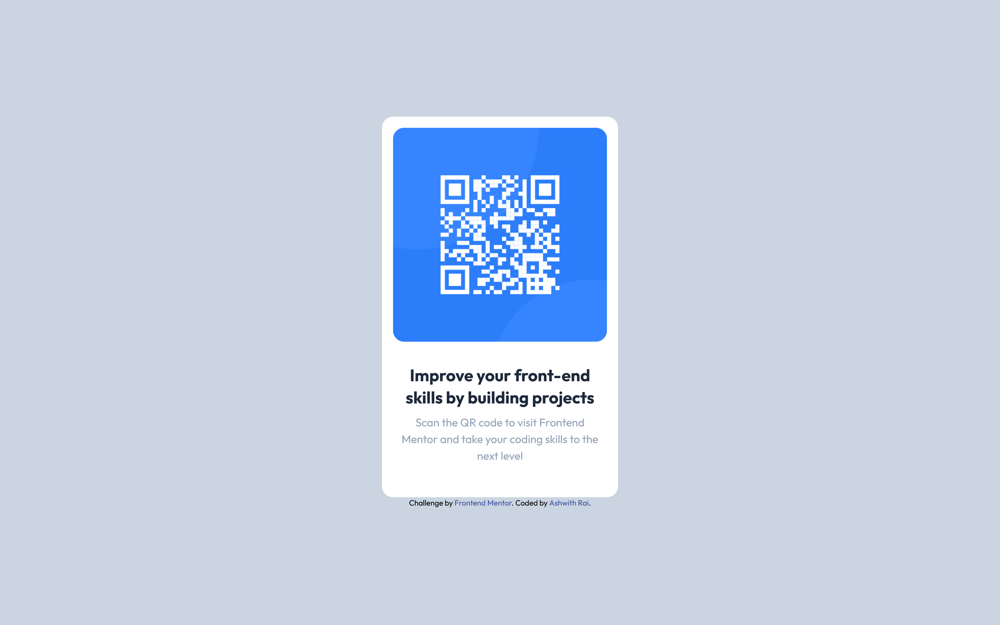

# Frontend Mentor - QR code component solution

This is a solution to the [QR code component challenge on Frontend Mentor](https://www.frontendmentor.io/challenges/qr-code-component-iux_sIO_H). Frontend Mentor challenges help you improve your coding skills by building realistic projects. 

## Table of contents

- [Overview](#overview)
  - [Screenshot](#screenshot)
  - [Links](#links)
- [My process](#my-process)
  - [Built with](#built-with)
- [Author](#author)

## Overview

### Screenshot
---

---

---

### Links

- Solution URL: [Solution URL](https://github.com/Rai-shwith/FM-Challenge-QR-code-component)
- Live Site URL: [Live site](https://rai-shwith.github.io/FM-Challenge-QR-code-component)

## My process

### Built with

- Semantic HTML5 markup
- CSS custom properties
- Flexbox

## Author

- Frontend Mentor - [@Rai-shwith](https://www.frontendmentor.io/profile/Rai-shwith)
- GitHub - [@Rai-shwith](https://github.com/Rai-shwith)
